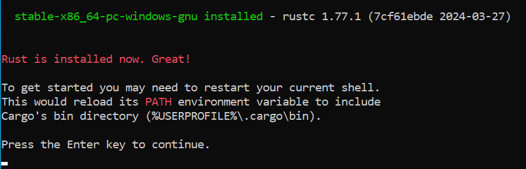

# Project, Simple HTTP Server Written in Rust

## Tente a [Versão em Português](README.md)!

## Project Objective
Learning, first contacts with Rust language.

## References and Credits
This project was based on another project of Http server project made in Rust, link below.<br>
Structure and variable naming: https://github.com/reidy-p/rust-http-server<br>
Also was the principal inspiration for creating a modified version of the original, already mentioned above.<br>

## Installing Needed Resources
I would recommend installing [RustRover IDE](https://www.jetbrains.com/rust/download/) which is available for all the three main operating systems to save up some time instead of configuring all using command prompt.<br>
Anyway, I'll be guiding(With instructions and images) to run this project using command prompt if you wish.

In case you already have everything configured, you can follow the [use instructions](#Use-Instructions)

| Resources                | Shortcuts                                                                            |
|--------------------------|--------------------------------------------------------------------------------------|
| Resources for Windows    | [Installing Resources for Windows](#Instalando-os-Recursos-para-o-Windows)           |
| Resources for Linux/macOS | [Installing Resources for Linux/macOS](#Instalando-os-Recursos-para-o-Linux-e-macOS) |

### Installing Resources for Windows
We'll be installing Rust with Rustup and defining our platform as target tool.

First, you'll head to [Rust org](https://www.rust-lang.org/tools/install) website, and download the executable installer for windows.


By executing the installer you'll come across this screen:


It says that you need to install C++ build tools for Visual Studio.<br>
And here's where I'll show you `two ways of installing Rust`.<br>
But you can take a look at the [Documentation](https://forge.rust-lang.org/infra/other-installation-methods.html#other-ways-to-install-rustup) for alternative methods of installing Rust.<br>
For the first way of installing we will ignore and continue, so just select `y`.


Let's select the option that indicates customization, and we'll pass the following arguments/Values for each option:

| Option                | Arguments/Value       |
|-----------------------|-----------------------|
| default host triple:  | x86_64-pc-windows-gnu |
| default toolchain:    | stable                |
| profile:              | default               |
| modify PATH variable: | yes                   |

With all the selected options, the installer will download what it needs and realize its configurations.<br>

Finally, you should see something like this at the end of the installation:



For the `second way` of installing(and here I warn you that you'll need a LOT more disk space than the first way), we'll consider that we are at [this step](#imagem1) on the installer.<br>
You just selected `y`, and now you see the default options.


And for this second way of installing we'll follow with "proceed" this time, right after finishing the installation, we will try to build the project directly to see the expected error.
(Error that you'll have IF, you don't have Visual Studio C++ build tools already installed.)


To solve this you'll need to install [Visual Studio C++ build tools](https://visualstudio.microsoft.com/thank-you-downloading-visual-studio/).

If you are using the 2019 version just search with your eyes this option, which is probably the first:


For the 2022 version it's the same, but it should be located down below:


You may observe that in the bottom right corner of these two last images, you will see that this way of installing Rust might take you quite large space from your precious local storage.

And finally, following up this second way of installing Rust, if you try to execute `"cargo build"` command on the project directory, where the file `Cargo.toml` is located, it should compile just fine, look at the second attempt:


Executing for the first time the command `"cargo build"` without having installed before [Visual Studio tools](https://visualstudio.microsoft.com/thank-you-downloading-visual-studio/), and the second attempt with it installed.

And so we conclude the installation of Rust on Windows, we can go now to the [project execution](#Project Execution).

### Installing Resources for Linux/macOS
First, you'll head to [Rust org](https://www.rust-lang.org/tools/install) website.

Let's start with `macOS`:

Copy the command which is pretty explicit in the website, paste it into your terminal and execute it.

For mac the options are the following:

| Option                 | Arguments/Value      |
|-----------------------|-----------------------|
| default host triple:  | x86_64-pc-windows-gnu |
| default toolchain:    | stable                |
| profile:              | default               |
| modify PATH variable: | yes                   |

And these options are already the default, so just select the options that corresponds to Proceed, and that is it, Rust installed successfully on macOS.

Now on `Linux`, you might need to install curl before.

If your package manager is APT then go ahead and execute `sudo apt install curl`.

If your package manager is Pacman then you'll probably are using ArchLinux, so execute: `"sudo pacman -Sy curl"`. (But you already know that bruh)

I am not going to list all the linux commands to install curl, just the ones I already used with the operational system that I used, 
but I recommend you to take a look [here](https://www.tecmint.com/install-curl-in-linux/) on how to install `curl` in other linux.

With Rust installed, we can go to [Project Execution](#project-execution)

## Project Execution

Let's start by cloning this project:
```sh
git clone https://github.com/WenderCouto/simple-rust-http-server.git
```
Enter the project path:
`` project-rust``

```sh
cd simple-rust-http-server/project-rust/
```
Execute the build command on the project:
```
cargo build
```
If there is any error I recommend verifying if you installed `rustup` with the configuration for your correct platform as in the [documentation](https://forge.rust-lang.org/infra/other-installation-methods.html#other-ways-to-install-rustup).

Still on the path `simple-rust-http-server/project-rust/`<br>

Execute:
```
cargo run src/main.rs
```

Now you are ready to [use](#Use-Instructions).

## Use Instructions

With the project already running, follow these steps:

1. Access your localhost and the configured port [http://localhost:8000/](http://localhost:8000/) (default) on your browser or API client.<br>
   

2. For the function echo, all you need to do is pass your message after the url [http://localhost:8000/echo/](http://localhost:8000/echo/) example below:
   

3. For the image function, all you need to do is pass your image directory with its extension (.jpeg, .jpg, .jpe, .gif, .png, .svg, .webp) in the json requisition body.
   For windows, you need to pass the absolute path with the file name and extension, for linux you can go with absolute path or relative path, but always with the file and extension.

Relative path on macOS:


Absolute path on macOS:


Absolute path on Windows:


## Updates
I probably won't change the images on portuguese.
Nothing yet.