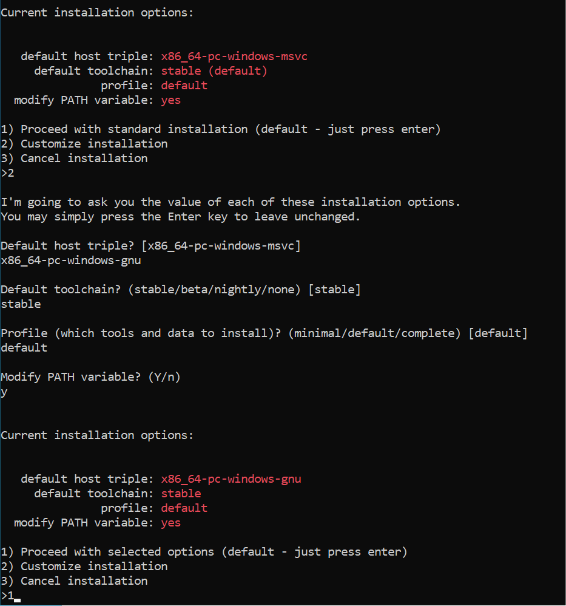
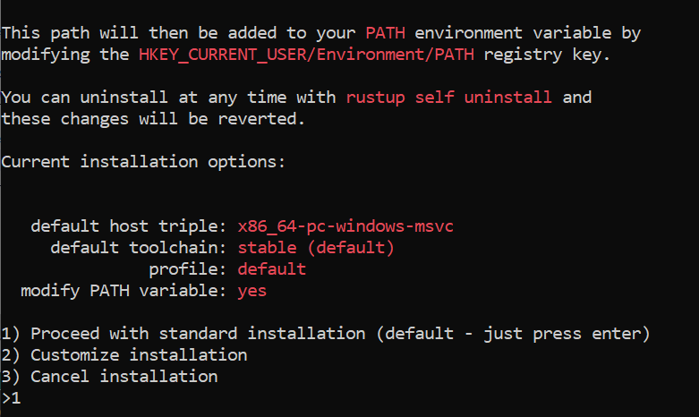
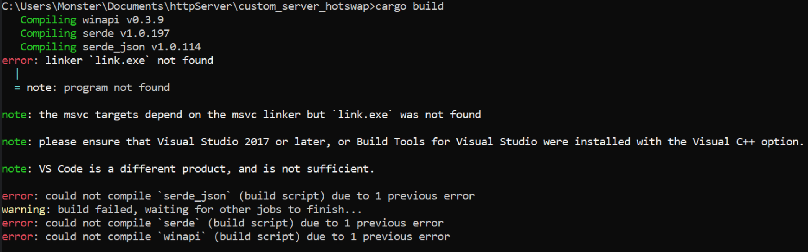

# Projeto, Servidor HTTP Simples Escrito em Rust

## Objetivo do Projeto
Aprendizado, Primeiros contatos com a linguagem Rust.

## Referências e Créditos
Este projeto foi baseado em outro projeto de Servidor Http feito em Rust, link abaixo.<br>
Estrutura e nomenclatura de variáveis: https://github.com/reidy-p/rust-http-server<br>
Também foi a principal inspiração para a criação de uma versão modificada do projeto original, já citado acima.

## Instalação dos recursos necessários:

Eu recomendaria instalar a [IDE RustRover](https://www.jetbrains.com/rust/download/) que está disponível para todos os três principais sistemas operacionais para poupar tempo configurando tudo pela linha de comando.<br>
Ainda assim, aqui irei ensinar(Com instruções e imagens) a rodar o projeto pela linha de comando se assim desejar.

Caso já tenha tudo configurado, pode seguir para as [Instruções de uso](#Instruções-de-uso)

| Recursos                  | Âncora/Links Atalhos                                                                      |
|---------------------------|-------------------------------------------------------------------------------------------|
| Recursos para Windows     | [Instalando os Recursos para o Windows](#Instalando-os-Recursos-para-o-Windows)           |
| Recursos para Linux/MacOS | [Instalando os Recursos para o Linux/MacOS](#Instalando-os-Recursos-para-o-Linux-e-MacOS) |

### Instalando os Recursos para o Windows:
Primeiramente você deve ir ao site do [Rust org](https://www.rust-lang.org/tools/install), fazer o download do instalador executavel.


Assim que executar o instalador você vai se deparar com essa tela:


Indica que você precisa do C++ build tools para o Visual Studio.<br>
E aqui vou demonstrar `duas maneiras de fazer a instalação`.<br>
Mas você pode consultar a [Documentação](https://forge.rust-lang.org/infra/other-installation-methods.html#other-ways-to-install-rustup) para ver outras formas de instalar.<br>
Para a `primeira maneira` vamos apenas ignorar e continuar, então só selecionar `y`.



Vamos selecionar a opção que indica customização, e passamos as seguintes opções:

| Opção                 | Argumentos/Valor      |
|-----------------------|-----------------------|
| default host triple:  | x86_64-pc-windows-gnu |
| default toolchain:    | stable                |
| profile:              | default               |
| modify PATH variable: | yes                   |

Com todas opções selecionadas, o instalador vai baixar o que precisa e realizar as configurações necessárias.<br>
Por fim você deve ver algo assim ao final da instalação:


Para a `segunda maneira` de instalar (e devo dizer que vai precisar de BEM mais espaço em disco), Vamos fazer o mesmo e considerar que estamos [nesta etapa](#imagem1) do instalador.</br>
Você acaba de selecionar `y`, e agora se depara com a opção padrão.</br>



E para essa segunda maneira vamos seguir com o proceed, logo após finalizar a instalação vamos tentar fazer o build do projeto direto para ver o erro já esperado.



Para resolver isso você vai precisar realizar a instalação do [Visual Studio tools](https://visualstudio.microsoft.com/pt-br/thank-you-downloading-visual-studio/)

Se você estiver usando a versão 2019 basta procurar com os olhos essa opção, que provavelmente é a primeira:


Para a versão 2022 é a mesma coisa, só que essa opção deve estar localizada um pouco mais em baixo:


Se você observar no canto inferior direito destas duas ultimas imagens vai ver que essa maneira de instalação pode levar um bom espaço do seu precioso armazenamento.

Por fim, seguindo nessa segunda maneira, se você tentar executar o `"cargo build"` no diretório do projeto, onde se encontra o arquivo `Cargo.toml` deve compilar sem problemas, Veja as duas tentativas:


Executado a primeira vez o comando `"cargo build"` sem ter instalado o [Visual Studio tools](https://visualstudio.microsoft.com/pt-br/thank-you-downloading-visual-studio/), e a Segunda vez com ele já instalado.

Com isso concluímos a instalação no Windows, Podemos ir para a [Execução do Projeto](#executando-o-projeto).

### Instalando os Recursos para o Linux e MacOS:
Primeiramente você deve ir ao site do [Rust org](https://www.rust-lang.org/tools/install)

Vamos começar com o `MacOS`:

Copie o comando que fica bem explicito no site, cole no seu terminal e execute.

Para o mac as opções são estas:

| Opção                 | Argumentos/Valor      |
|-----------------------|-----------------------|
| default host triple:  | x86_64-pc-windows-gnu |
| default toolchain:    | stable                |
| profile:              | default               |
| modify PATH variable: | yes                   |

E estas opções já são o padrão, então basta Selecionar a opção que correponde ao Proceed.

Já no `Linux`, você pode precisar instalar o `curl` antes.

Então abra o seu terminal e execute: `"sudo apt install curl"` Se o seu gerenciador de pacotes for o APT.

Se o Seu gerenciador de pacotes for o Pacman você provavelmente está usando ArchLinux, então o comando será: `"sudo pacman -Sy curl"`.

Não vou listar todos aqui só coloquei acima os que já usei, mas recomendo ver [neste link](https://www.tecmint.com/install-curl-in-linux/) como instalar o `curl` em outros linux.

Com o Rust instalado, Podemos ir para a [Execução do Projeto](#executando-o-projeto).

## Executando o Projeto

Vamos começar por clonar este projeto:
```sh
git clone https://github.com/WenderCouto/simple-rust-http-server.git
```
Entre na pasta do projeto:
`` project-rust``

```sh
cd project-rust/simple-rust-http-server/
```
Execute o build do projeto com o comando:
```
cargo build
```
Se houver algum erro recomendo verificar se instalou o `rustup` para plataforma correta de acordo com a [documentação](https://forge.rust-lang.org/infra/other-installation-methods.html#other-ways-to-install-rustup).

Ainda na pasta `project-rust/simple-rust-http-server/`<br>
Execute:
```
cargo run src/main.rs
```

Agora é só [usar](#instruções-de-uso).

## Instruções de uso

Com o projeto já rodando, siga estes passos:

1. Acesse o localhost e a porta configurados [http://localhost:8000/](http://localhost:8000/) no seu navegador ou no seu API Client.</br>
Para este projeto foi usado o [Insomnia](https://insomnia.rest/download).</br>
(Imagem aqui.)

2. Para função echo, basta passar sua menssagem após a url [http://localhost:8000/echo/](http://localhost:8000/echo/) Segue exemplo abaixo.</br>
(imagem aqui)

3. Para função de imagem, basta passar o caminho da imagem com sua extensão no corpo da sua solicitação json.
Para o Windows você deve fornecer o caminho absoluto, para o linux você pode optar por usar o caminho absoluto ou o caminho relativo.
(imagem aqui)

## Atualizações
Se você estiver vendo esse documento na data de Hoje 10/04/2024, Amanhã revisarei o documento e irei fazer a tradução para o inglês.
If you are seeing this document today, 04/10/2024, tomorrow I will review the document and translate it into English.

Farei mais uma alteração no código para tratar de caminhos relativos no windows em breve.